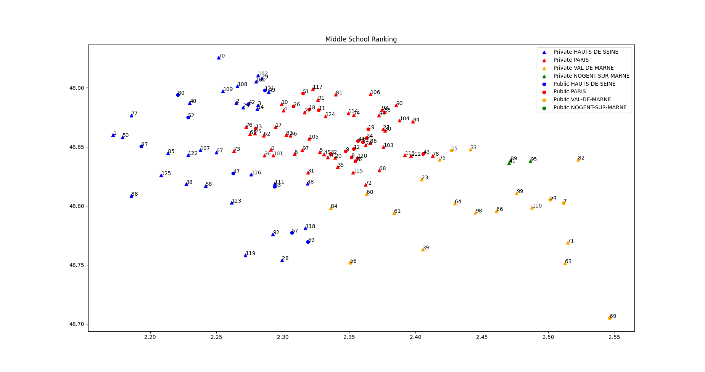

# FrMiddleSchoolRanking
Help to select the convenient middle school for your kids :)

## Objective
It's not an easy decision to select a suitable school for my kids. For my case I have to identify a middle school (collège) for my son, and there are many criteria to verify to make everyone happy (especially his mother ;) ).

Hence, I tried to use the available data from https://data.education.gouv.fr to make the wisest decision based on the following parameters:
* Maximize his admission chance in the institution (It's nightmare in ile-de-france)
* Private vs Public school
* Success rate
* Qualification with distinction
* Distance from/to home

## Overview

Use `pandas` to parse input csv files, generate an output csv file sorting the schools and `matplotlib.pyplot` for the visualisation.

### Command line

```
 ./select-my-middle-school.py -h
usage: select-my-middle-school.py [-h] [--session SESSION] [--successRate SUCCESSRATE] [--tresBienRate TRESBIENRATE] region deps town longlat

positional arguments:
  region                Your region.
  deps                  Your departments list eg: "HAUTS-DE-SEINE,PARIS,VAL-DE-MARNE".
  town                  Your town.
  longlat               Your coordinates (longitude, latitude), eg "2.487970,48.846350".

optional arguments:
  -h, --help            show this help message and exit
  --session SESSION     Session number.
  --successRate SUCCESSRATE
                        Success rate %.
  --tresBienRate TRESBIENRATE
                        Tres bien rate between [0,1].
```

### Execution trace

```
$ ./select-my-middle-school.py ILE-DE-FRANCE HAUTS-DE-SEINE,PARIS,VAL-DE-MARNE NOGENT-SUR-MARNE 2.483970,48.836350
>>> Total records: 130764
>>> Keep only COLLEGE related to my region ILE-DE-FRANCE and session 2020:
>>> Remaining records: 1128
>>> Keep only records related to my departments ['HAUTS-DE-SEINE', 'PARIS', 'VAL-DE-MARNE']:
>>> Remaining records: 435
>>> Filter by success rate threshold 97%:
>>> Remaining records: 128
>>> Filter by tres bien rate threshold 97%:
>>> Remaining records: 126
>>> Compute distances:
>>> Sort records by : 'Taux très bien %', 'Admis', 'Taux de réussite', 'Rank Distance', 'Rank Departement'
>>> Write output : 'college_selection.csv'
```

### Visualisation as a map 

